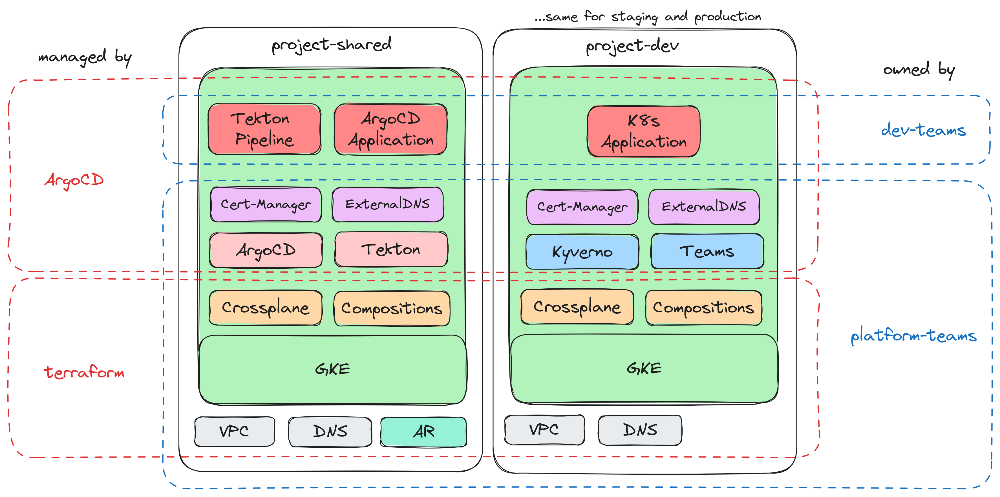

# `dogcat`

Dogcat is a complex demo trying to illustrate an application delivery process 
involving both the development team, but also a platform team providing an
internal developer platform (IDP).

## Overview

In `chapter01` the development team leverages serverless technology to quickly
execute their POC and make it available. However the decision is made to migrate
the application to the existing Kubernetes platform.

From the perspective of the platform-team `chapter02a` goes into how the platform
is assembled and how functionality is provided to development teams leveraging
Kubernetes' resource model (KRM).

Finally `chapter02b` is migrating and deploying the application to the platform
and illustrating how the team is adopting the established workflows.

_**NOTE**_: Keep in mind that the platform created by this demo might not fit
your needs and was tailored to the (fictional) needs of the (fictional) teams.
You can find some background about the development team in `chapter01` and `chapter02b`
gives an outline of the platform team.

## OSS-Components

As seen in the diagram above, the platform leverages several OSS components and tools.
To quickly get an idea about the purpose and scope of this demo, see the below list 
with comments regarding their usage:
* [terraform](https://github.com/hashicorp/terraform): Used by the platform team to provision the cloud resources for the IDP and indirectly used by Crossplane Compositions to expose functionality to development teams.
* [Crossplane](https://github.com/crossplane/crossplane): Platform team provides Crossplane Compositions to development teams for extended capabilities in Kubernetes, such as WorkloadIdentity, IAP and CloudSQL.
* [ArgoCD](https://github.com/argoproj/argo-cd): Used for continuous declarative deployments following GitOps paradigm.
* [Tekton](https://github.com/tektoncd): Primary CI system of the IDP: Platform team provides task templates that can be leveraged by development teams. Tekton chains will automatically attest and sign the process and artifacts.
* [cert-manager](https://github.com/cert-manager/cert-manager): Automatically provides TLS certifcates using DNS01 challenges for Ingress resources.
* [external-dns](https://github.com/kubernetes-sigs/external-dns): Automatically create DNS records for Ingress resources.
* [Kyverno](https://github.com/kyverno/kyverno): Policies and constraints for GKE clusters, e.g. only allow signed images, enforce labels, ...

## Cloud Services

While `chapter01` mainly leverages:
* [Cloud Run](https://cloud.google.com/run) as serverless platform.
* [Cloud SQL](https://cloud.google.com/sql) is used as managed Postgres database.

This is extended in `chapter02a` which also touches the following Google Cloud resources:
* [VPC](https://cloud.google.com/vpc) provides the underlying network for the platform.
* [Cloud DNS](https://cloud.google.com/dns) is used for dedicated zones for each project.
* [Artifact Registry](https://cloud.google.com/artifact-registry) is the docker container registry and also stores the signatures.
* [Cloud Key Management](https://cloud.google.com/security-key-management) is used to sign images and attest the CI process.
* [Google Kubernetes Engine (GKE)](https://cloud.google.com/kubernetes-engine/) provides the Kubernetes cluster and some related functionality such as WorkloadIdentity and an Ingress controller to create load-balancers.
* [Identity-Aware Proxy](https://cloud.google.com/iap) is used to protect internal services to only allow access by particular users or domains.
