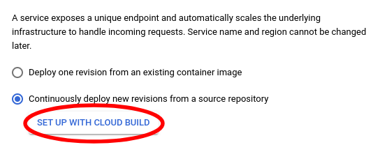
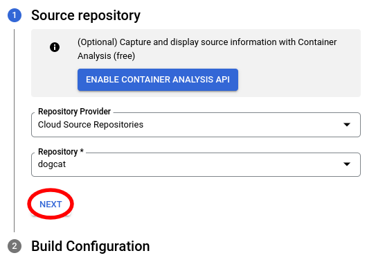
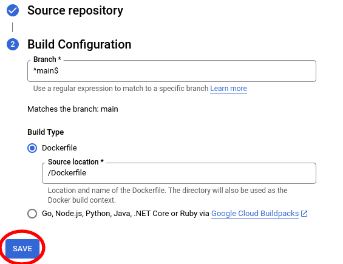
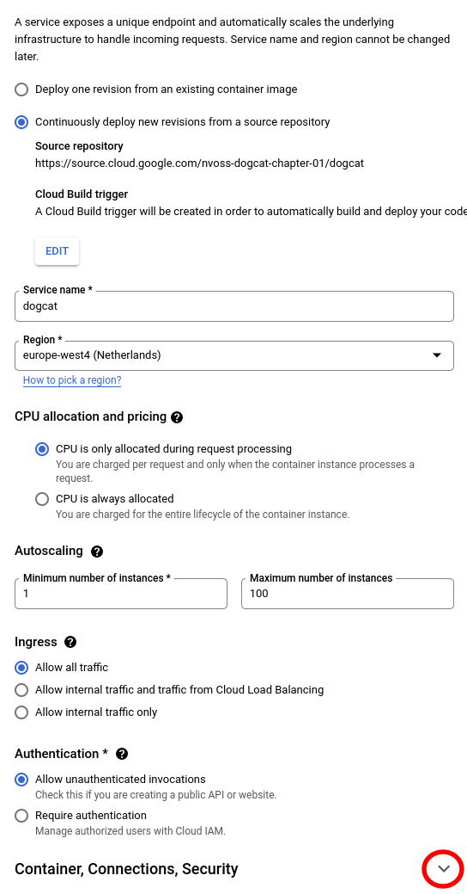
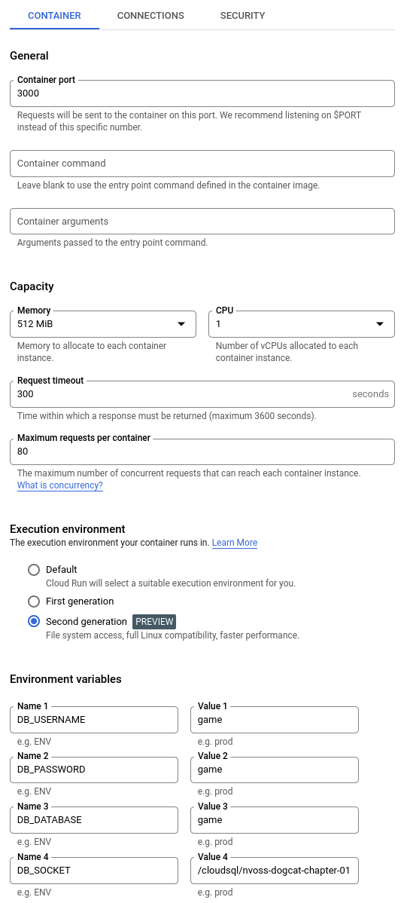
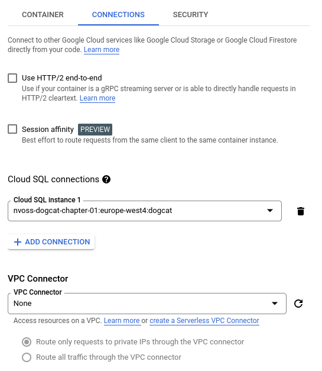
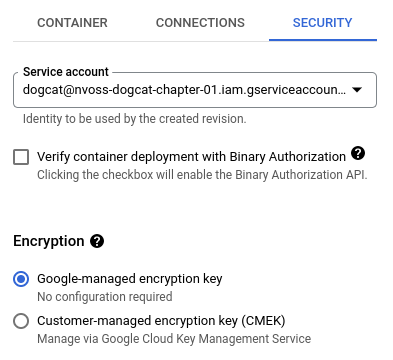
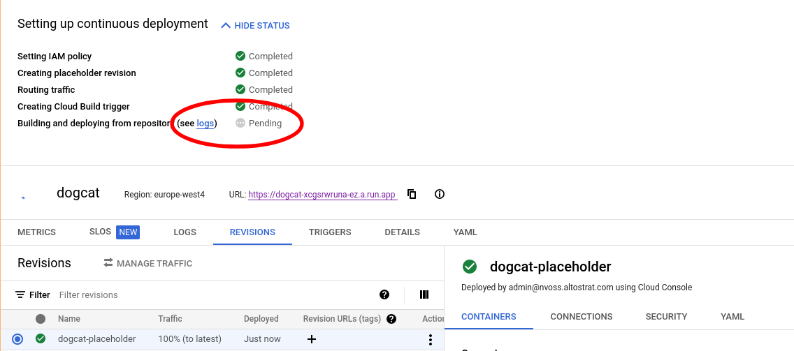
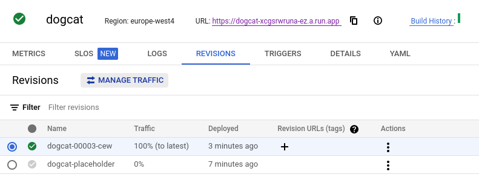

# Chapter 01: Favoring Agility for Fast Experimentation of New Services

## Introduction

The company's general approach to new game ideation favors implementing a minimum viable product (MVP), deploying to real users for feedback and making frequent, iterative improvements. Thus, it is important that MVPs are developed quickly and repeatably delivered into users' hands as early as possible.

The DogCat-team has determined their MVP will require two components:

1. A front-end application providing the user interface for the game. The team has chosen [React](https://reactjs.org/) as they were already familiar with it. While React is not the optimial solution they reckon they can iterate quickly and performance of their 2d game should not be a concern.

2. A back-end service providing a leaderboard for submission and retrieval of high scores and part of the game logic, which will be vital for future social interactions between players. The team has decided to prototype both frontend and backend using [NextJS](https://nextjs.org/) and use Postgres in production.

As we begin this chapter, the product team has completed development work on both frontend and backend and successfully tested them locally using SQLite. The product owner is happy with what the team has achieved in such a short time and have requested that they deploy to a production environment that their beta testers can access.

## Prerequisites

From a tutorial perspective, the first step is create a new GCP project and replicate what the DogCat team has done in theirs. All commands are expected to be run from Cloud Shell using gcloud already configured to point to the new project.

If you work locally you will have to setup your `gcloud` config accordingly and make sure the environment-variables, such as `GOOGLE_CLOUD_PROJECT` are setup.

### Argolis users only

In order to create public Cloud Run services, you will need to override an org policy for the new project. This can be done with the following command:

```bash
$ gcloud services enable orgpolicy.googleapis.com
Operation "operations/xxx.xxxxxxxxxx" finished successfully.
$ jq -n --arg project $GOOGLE_CLOUD_PROJECT '{"name":"projects/\($project)/policies/iam.allowedPolicyMemberDomains","spec":{"rules": [{"allowAll":true}]}}' > my-policy.json ; gcloud org-policies set-policy my-policy.json ; rm my-policy.json
Created policy [projects/xxx/policies/iam.allowedPolicyMemberDomains].
name: projects/xxx/policies/iam.allowedPolicyMemberDomains
spec:
  [...]
```

### Enable the necessary GCP services

The GCP project needs to have the following APIs enabled:

- Cloud Source Repositories
- Cloud SQL
- Cloud Run 
- Cloud Build

Run the following from Cloud Shell:

```bash
$ gcloud services enable compute.googleapis.com
Operation "operations/xxx.xxxxxxxxxx" finished successfully.
$ gcloud services enable sourcerepo.googleapis.com
Operation "operations/xxx.xxxxxxxxxx" finished successfully.
$ gcloud services enable sqladmin.googleapis.com
Operation "operations/xxx.xxxxxxxxxx" finished successfully.
$ gcloud services enable run.googleapis.com
Operation "operations/xxx.xxxxxxxxxx" finished successfully.
$ gcloud services enable cloudbuild.googleapis.com
Operation "operations/xxx.xxxxxxxxxx" finished successfully.
```

### Create the Git repository

You will need to replicate the team's Git repository in your GCP project.

First, create the new source repository:

```bash
$ gcloud source repos create dogcat.git
Created [dogcat].
WARNING: You may be billed for this repository. See https://cloud.google.com/source-repositories/docs/pricing for details.
```

The above Git repository requires us to push code directly to the repository, e.g. adding an additional `google`-remote and pushing with `git push google main`.

Most likely you want to setup mirroring as described [here](https://cloud.google.com/source-repositories/docs/mirroring-a-github-repository#mirror_a_github_repository). Then no direct interaction with the GCP repository is required.

With all the code available in the GCP repository, we can start deploying.

## Deployment

The DogCat product team has decided to run the service as a containerized application. Because they currently have little experience with containers or operating container infrastructure, they have decided to go serverless with Cloud Run. They particularly want to take advantage of its ability to automatically perform continuous deployment from a Git source repository and manage multiple revision of a service with traffic splitting.

### Create the PostgreSQL database

First, create the CloudSQL instance:
```bash
$ gcloud sql instances create dogcat --database-version=POSTGRES_12 --region=europe-west4 --cpu=1 --memory=4GiB
Creating Cloud SQL instance...done.
```

Next, create the database:
```bash
$ gcloud sql databases create game --instance=dogcat
Creating Cloud SQL database...done.
```

Finally, create the database user:
```bash
$ gcloud sql users create game --instance=dogcat --password=game
Creating Cloud SQL user...done.
```

The database is now ready. **You will need its instance name for a later step, so run the following command to obtain it**:
```bash
$ gcloud sql instances describe dogcat --format json | jq -r '.connectionName'
xxx:europe-west4:dogcat
```

### Create the Service Account

First, create a service account to be used by the Cloud Run service:
```bash
$ gcloud iam service-accounts create dogcat
Created service account [dogcat].
```
Next, give the new service account permission to access Cloud SQL:
```bash
$ gcloud projects add-iam-policy-binding $GOOGLE_CLOUD_PROJECT --member=serviceAccount:dogcat@$GOOGLE_CLOUD_PROJECT.iam.gserviceaccount.com --role=roles/cloudsql.client
...
version: 1
```

### Create the Cloud Run Service

We will create the Cloud Run service using the GCP console to make use of its ability to trigger a new build and service revision deployment anytime the Git source repository changes.

From the console, go to the Cloud Run tab and click the "Create Service" button:


Step 1: Select continuous deployment from a source repository and continue to the setup wizard by clicking the "Set up with Cloud Build" button underneath.



Step 2: Select "Cloud Source Repositories" as the provider and "dogcat" as the repository then click "Next":



Step 3: The team wants to trigger a new build anytime the main branch changes. Fill out the "Build Configuration" as shown below and click "Save":



Step 4: To keep cost to a minimum, the team will stick with the "CPU is throttled outside of request" option for CPU allocation. The service should be public and therefore they allow ingress. Fill out the values as follows and click the expansion arroiw of the "Container, Connections, Security" section:



Step 5: In the "Container" tab we need to specify the correct port and setup the environment variables to provide the database configuration to our service. The required environment variables are `DB_USERNAME`, `DB_PASSWORD`, `DB_DATABASE` and `DB_SOCKET`. The last one is particularly important as when database connections are added to a Cloud Run service they are exposed as sockets in the `/cloudsql/` folder (**use the Cloud SQL instance name you made note of in the previous section**).



Step 6: We continue to the "Connections" tab and actually add the required connection to our created database instance.



Step 7: Next we navigate to the "Security" tab and make sure to select our created Service Account with access to the database:



Step 8: Finally we click "Create" at the very bottom of the configuration page:


Step 9: Now we are greeted with information about our newly created Cloud Run service. However at this point in time our service will not yet be fully available. We are still waiting for Cloud Build to finish building our application:



Step 10: After a few minutes our first Cloud Build is finished and our first revision is live:



### Testing

You should now be able to access the application by pointing your web browser to the URL shown in the Cloud Run service details. Alternatively, you can retrieve the URL as follows:
```bash
$ gcloud run services describe dogcat --format=json --region=europe-west4 | jq -r '.status.url'
```

## Retrospective

The team has quickly and successfully delivered DogCat to a delighted group of beta testers and product owners. After a much earned celebration, they did a retrospective to identify areas of improvement.

1. The database password is being passed as an environment variable to the Cloud Run service. Even though access is still controlled via GCP IAM, the service should be obtaining the password in a more secure way.

2. The service account used by the Cloud Run service has access to ALL Cloud SQL databases in the GCP project. Following the principle of least privilege, it should only have access to the dogcat database.

3. The team also noticed that image sizes are fairly large and is keeping this in mind as future optimization as this can impact how fast the application can scale up.

